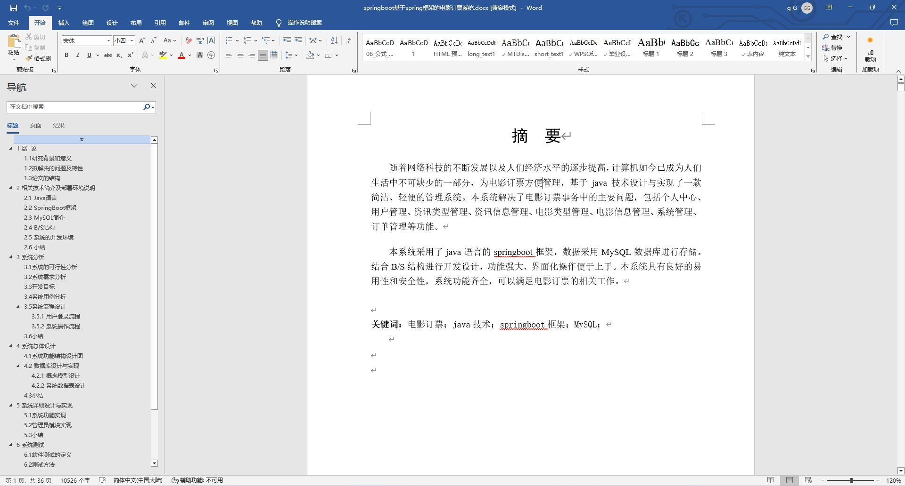
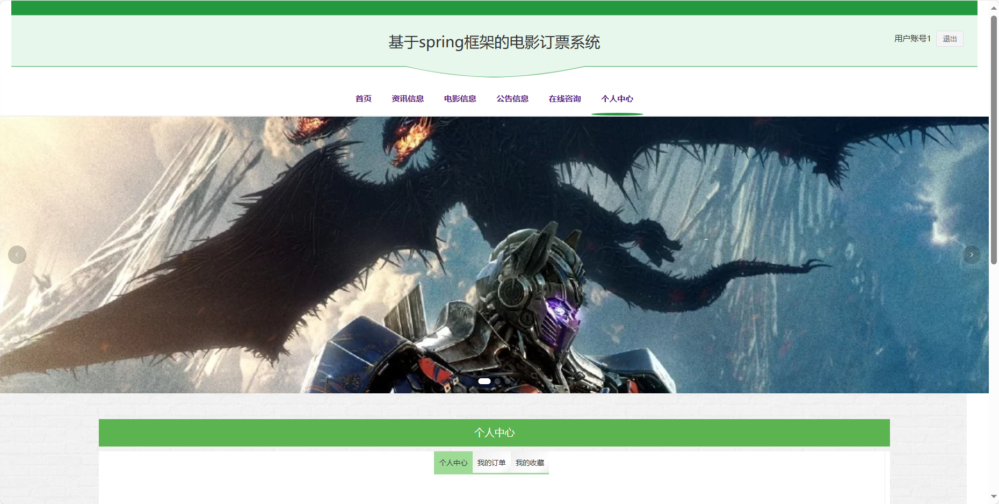
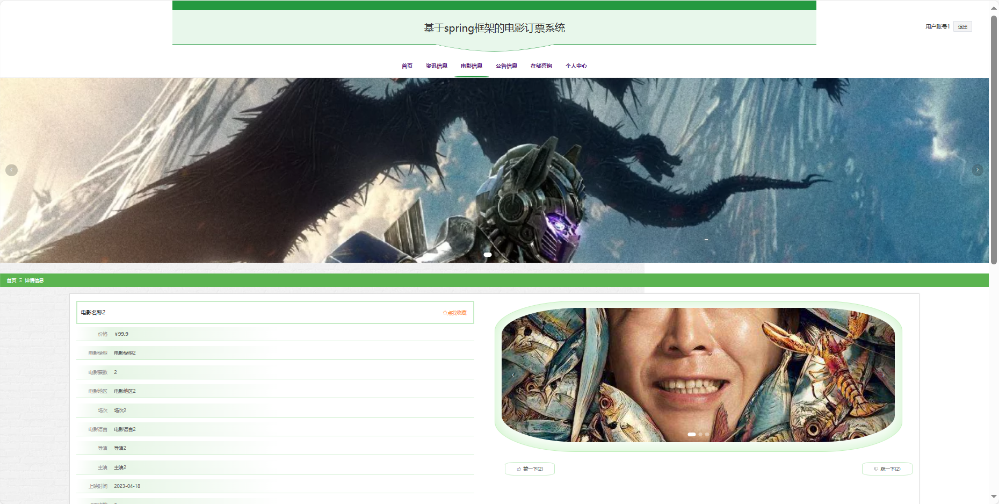

基于Springboot的电影订票系统（程序+论文）
=
### 完整代码获取地址：从戎源码网 ([https://armycodes.com/](https://armycodes.com/))
### 作者微信：19941326836  QQ：952045282 
### 承接计算机毕业设计、Java毕业设计、Python毕业设计、深度学习、机器学习
### 选题+开题报告+任务书+程序定制+安装调试+论文+答辩ppt 一条龙服务
### 所有选题地址https://github.com/nature924/allProject

一、项目介绍
---
基于Spring Boot框架实现的电影订票系统，系统包含两种角色：管理员、用户主要功能如下。

### 【用户功能】

首页：浏览系统电影动态。
资讯信息：获取有关电影行业的新闻和资讯。
电影信息：查看电影的详细信息和排片情况。
公告信息：获取系统发布的重要公告。
在线咨询：与客服进行在线咨询和解答。
个人中心：管理个人信息和查看订单记录。
### 【管理员功能】

系统首页：系统首页。
个人中心：管理管理员的个人信息。
用户管理：维护系统用户的账户信息。
资讯类型管理：管理电影资讯的分类。
资讯信息管理：发布、编辑和管理系统的资讯信息。
电影类型管理：管理电影的分类。
电影信息管理：发布、编辑和管理系统的电影信息。
系统管理：管理系统的基本设置。
订单管理：查看和管理用户的电影订票订单记录。

二、项目技术
---
- 编程语言：Java
- 数据库：MySQL
- 项目管理工具：Maven
- 前端技术：VUE、HTML、Jquery、Bootstrap
- 后端技术：Spring、SpringMVC、MyBatis

三、运行环境
---
- 操作系统：Windows、macOS都可以
- JDK版本：JDK1.8以上都可以
- 开发工具：IDEA、Ecplise、Myecplise都可以
- 数据库: MySQL5.7以上都可以
- Tomcat：任意版本都可以
- Maven：任意版本都可以

四、运行截图
---
### 论文截图：

### 程序截图：

